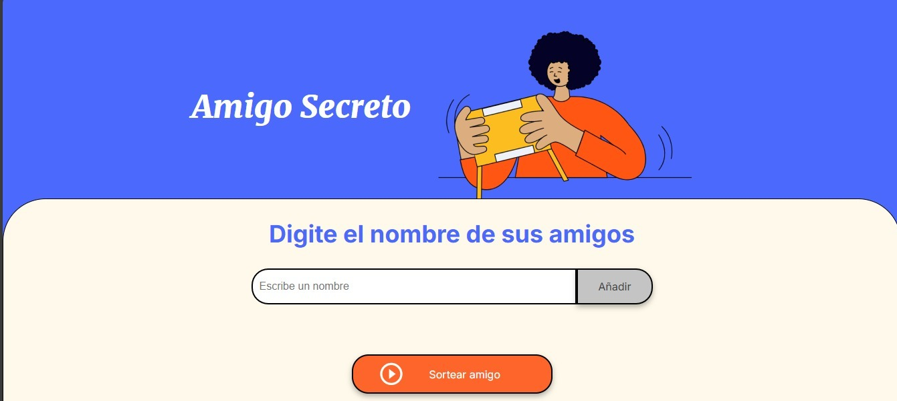
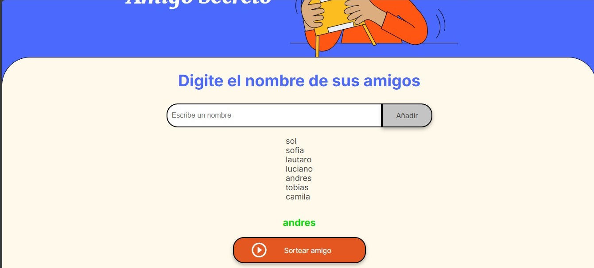
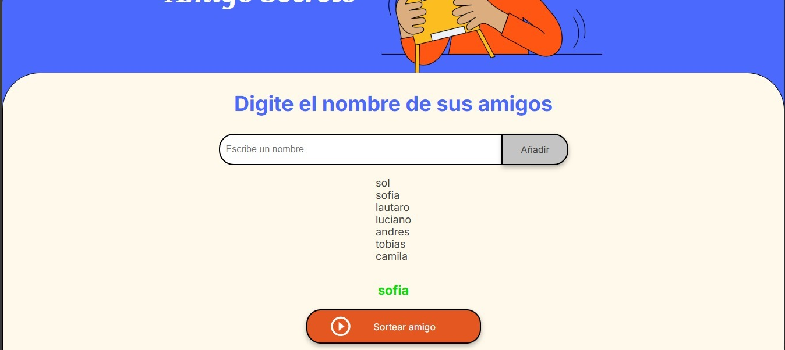

# Challenge: Amigo Secreto

Este proyecto es una aplicación web sencilla que permite al usuario agregar nombres a una lista de amigos, visualizar la lista actualizada y seleccionar un amigo al azar. 🚀

## Tecnologías utilizadas
- **HTML**: estrctura de la pagina.
- **CSS**: estilos básicos.
- **JavaScript**: lógica del proyecto e interacción con el usuario.

## Cómo usar
1. Escribir un nombre en el campo de entrada y hacer clic en "Agregar Amigo".

2. Ver la lista de amigos en pantalla.

3. Hacer clic en "Sortear Amigo" para seleccionar uno al azar.

## Funcionalidades

- Agregar nombres a la lista de amigos.

- Mostrar la lista actualizada en pantalla.

- Sortear un amigo aleatoriamente.

- Validaciones para evitar entradas vacías y sorteos sin nombres en la lista.

## Imagenes del proyecto

## Acceso rápido
https://solalcaraz.github.io/Challenge_Amigo_Secreto-ONE/

---
### Autor
Desarrollado por **Sol Alcaraz** como parte del aprendizaje en **ONE | Alura Latam**.

