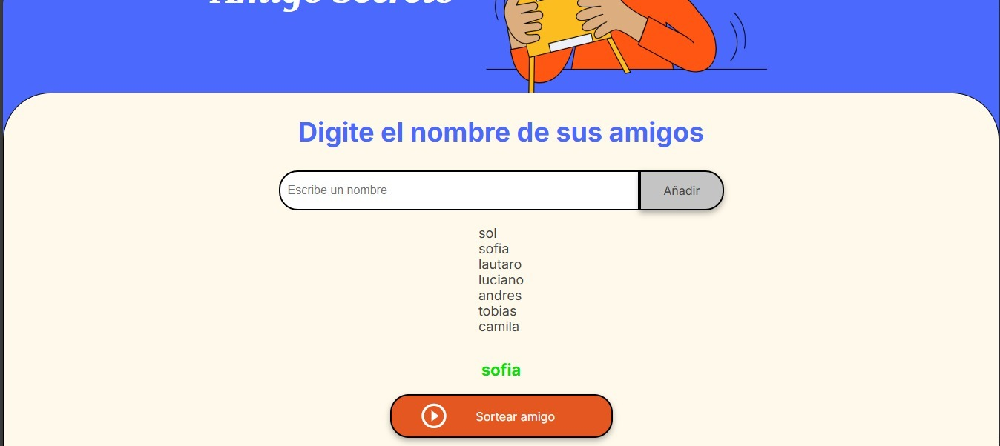

# Proyecto Amigo Secreto

## Descripción

Este proyecto es una aplicación web sencilla que permite al usuario agregar nombres a una lista de amigos, visualizar la lista actualizada y seleccionar un amigo al azar. Está desarrollado con HTML, CSS y JavaScript puro, sin frameworks adicionales.

## Funcionalidades

- Agregar nombres a la lista de amigos.

- Mostrar la lista actualizada en pantalla.

- Sortear un amigo aleatoriamente.

- Validaciones para evitar entradas vacías y sorteos sin nombres en la lista.

## Cómo usar

- Escribir un nombre en el campo de entrada y hacer clic en "Agregar Amigo".

- Ver la lista de amigos en pantalla.

- Hacer clic en "Sortear Amigo" para seleccionar uno al azar.

## Imagenes del proyecto

